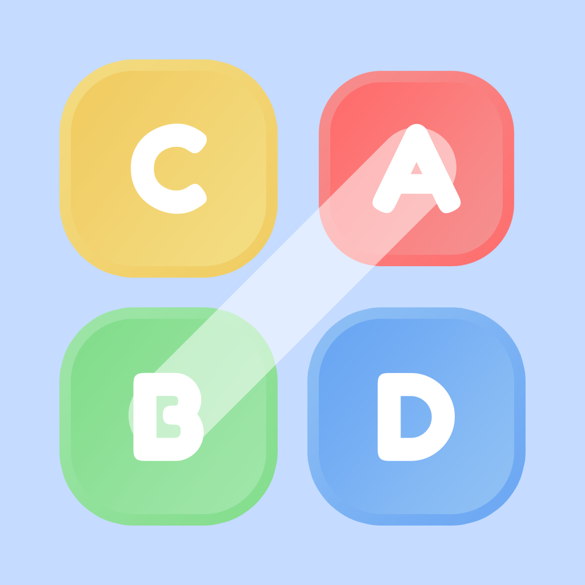

# LettroLine

  

**LettroLine** est un jeu de mots captivant où vous devez tracer des lignes pour connecter des lettres et révéler des mots cachés. Suivez le tracé, découvrez des bonus et améliorez votre score au fil des parties !

---

## 🎮 Modes de jeu

### 🎯 Mode Classique
Le mode principal où vous reliez les lettres dans une grille pour recréer des mots. Chaque mot trouvé augmente votre score et débloque des mots de plus en plus longs et complexes. Votre progression est sauvegardée automatiquement.

### 📖 Mode Histoire
Plongez dans des histoires interactives divisées en chapitres. Chaque chapitre contient une série de mots à découvrir qui font avancer le récit. Explorez différents genres et découvrez de nouvelles aventures !

### 💪 Défis (Challenges)
Trois modes de défi pour tester vos compétences :

| Mode | Description |
|------|-------------|
| ⏱️ **Chrono** | Vous avez 60 secondes pour marquer le maximum de points. Chaque mot complété vous accorde 3 secondes supplémentaires ! |
| 🔢 **Coups limités** | Gardez un œil sur vos coups : chaque mouvement compte ! |
| ✋ **Continu** | Tracez sans jamais lever votre doigt de l'écran, sinon c'est perdu ! |

---

## ✨ Fonctionnalités

### 🎲 Gameplay
- **Tracé intuitif** : Glissez votre doigt pour relier les lettres adjacentes (horizontalement, verticalement ou en diagonale)
- **Grille dynamique** : Chaque partie génère une nouvelle configuration unique
- **Détection de collision** : Le tracé ne doit jamais se croiser
- **Progression adaptative** : Les mots deviennent plus longs à mesure que vous progressez

### ⭐ Système de bonus
- Collectez des bonus en passant sur les étoiles présentes dans la grille
- Utilisez vos bonus pour afficher la solution lorsque vous êtes bloqué
- Regardez une publicité pour obtenir un bonus gratuit

### 🏆 Classements
Comparez vos scores avec d'autres joueurs du monde entier ! Les classements sont disponibles pour :
- Mode Classique
- Défi Chrono
- Défi Coups limités
- Défi Continu

### 🎁 Récompenses quotidiennes
Remplissez 3 objectifs quotidiens pour gagner 3 bonus :
1. Se connecter au jeu
2. Compléter un mot
3. Battre l'un de vos meilleurs scores

### 👤 Profil utilisateur
- Personnalisez votre pseudo
- Avatar généré automatiquement (style Boring Avatar)
- Suivez vos meilleurs scores

---

## ⚙️ Réglages

| Option | Description |
|--------|-------------|
| 🔊 Sons | Activez/désactivez les effets sonores |
| 🎵 Musique | Activez/désactivez la musique de fond |
| 📳 Vibrations | Activez/désactivez le retour haptique |

---

## 💎 Version Premium

Supprimez les publicités définitivement avec un achat unique !
- Plus de bannières publicitaires
- Plus de vidéos entre les parties
- Possibilité de restaurer un achat précédent

---

## 🛠️ Technologies utilisées

- **Swift**
- **UIKit**
- **Firebase Firestore**
- **Google Mobile Ads**
- **StoreKit**
- **SnapKit**

---

## Support Utilisateur

Pour toute question ou demande d'assistance, veuillez nous contacter par e-mail à l'adresse suivante :  
[michou855@hotmail.com](mailto:michou855@hotmail.com)